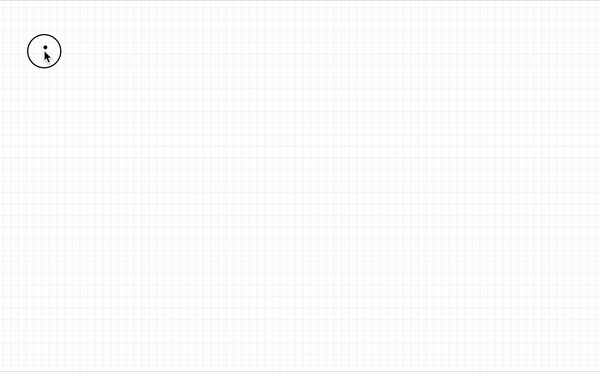

Under construction

``` 

                                  __________
                                 || .------.|
                                 ||/       [|
                                 |||      /||
                                 |||\    | [|
              _     ________ _   |||.'___| |'---...__
             /o)===|________(o\  ||========|         ``-..
            / /       _.----'\ \ |'=.====.='  ________    \
           / |     .-' ----. / | |  |____|  .'.-------.\   |
           \  \  .'_.----._ \  | _\_|____|.'.'_.----._ \\__|
     /\     \  .'.'   __   `.\ |-_| |____| /.'   __   '.\   |
    // \     \' /   /    \   \\|-_|_|____|//   /    \   \`--'
   //   \    / .|  |      |  |      |____| |  |      |  |
  //     \ .'.' |   \ __ /   |             |   \ __ /   |
 //      /'.'    '.        .'               '.        .'
//_____.'-'        `-.__.-'                   `-.__.-' LGB


        (ascii clip art by ascii.co.uk/art/roadworks)
```

Demo: https://monoflowapp.github.io/demo/

Keyboard Command   | Function
-------------------|---------
R                  | Draw rectangle
T                  | Draw text
DELETE             | Remove selected shape(s)
ESC                | Deselect, enter select mode
UP/DOWN/LEFT/RIGHT | Move selected shape(s)

First showcase:


